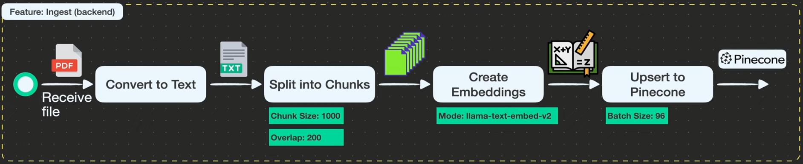

# Agentic Personal Assistant

A full-stack Retrieval-Augmented Generation (RAG) assistant where you can upload PDF files, ingest them into Pinecone, and chat with an agent that can search your uploaded knowledge base.

This repository has been migrated to TypeScript for both frontend and backend.


## Overview

- Frontend: React 19 + Vite + TypeScript
- Backend: Express + TypeScript (Node ESM, tsx in dev)
- Agent: LangChain createAgent with tool calling
- Vector DB: Pinecone
- Embeddings: llama-text-embed-v2 via Pinecone embeddings
- LLM: OpenAI gpt-4.1-nano
- Optional tracing: LangSmith

## Features

- Upload PDF documents for ingestion
- Split and embed document chunks into Pinecone
- Ask questions through an agentic chat API
- Tool-based retrieval from uploaded knowledge
- Session-aware chat through sessionId
- Strict TypeScript checks across client and server

### File ingestion flow



## Prerequisites

- Node.js 18+
- npm
- OpenAI API key
- Pinecone API key and an existing Pinecone index
- LangSmith credentials (optional)

## Setup

1. Install dependencies from the repository root.

  ```bash
  npm run install:all
  ```

2. create server/.env with your real keys.

  ```env
  # LLM
  OPENAI_API_KEY=your_openai_api_key

  # Vector DB (Pinecone)
  PINECONE_API_KEY=your_pinecone_api_key
  PINECONE_INDEX=your_pinecone_index_name

  # Optional LangSmith tracing
  LANGSMITH_TRACING=true
  LANGSMITH_ENDPOINT=https://api.smith.langchain.com
  LANGSMITH_API_KEY=your_langsmith_key
  LANGSMITH_PROJECT="Agentic RAG"
  ```

## Running the App

From the repository root:

```bash
npm run dev
```

Default ports:

- Client: <http://localhost:5173>
- Server: <http://localhost:3001>

Run only one side when needed:

```bash
npm run dev:client
npm run dev:server
```

## Scripts

Root (package.json):

- npm run dev: run server and client concurrently
- npm run dev:server: run server workspace dev command
- npm run dev:client: run client workspace dev command
- npm run typecheck: run server and client type checks
- npm run lint: run lint fix + format in both workspaces
- npm run install:all: install root/client/server dependencies

Client (client/package.json):

- npm --prefix client run dev
- npm --prefix client run build
- npm --prefix client run typecheck
- npm --prefix client run lint

Server (server/package.json):

- npm --prefix server run dev
- npm --prefix server run build
- npm --prefix server run typecheck
- npm --prefix server run start

## API Endpoints

### POST /api/chat

Request body:

```json
{
  "message": "What does the uploaded PDF say about X?",
  "sessionId": "optional-session-id"
}
```

Success response:

```json
{
  "answer": "..."
}
```

Error response:

```json
{
  "error": "..."
}
```

### POST /api/ingest

- Content type: multipart/form-data
- File field name: file
- Allowed file type: PDF
- Upload limit: 25 MB

Success response:

```json
{
  "ok": true
}
```
